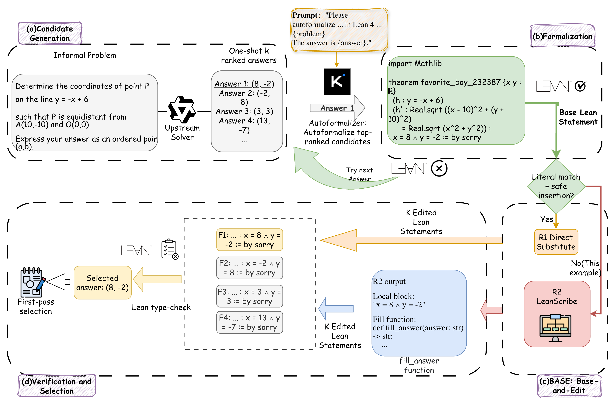

# Efficient Autoformalization for Lean-Based Answer Selection

Official code release for the paper [**Formalize Once, Edit the Rest:
Efficient Lean-Based Answer Selection for Math Reasoning**](https://arxiv.org/abs/2606.15972).

We propose **base-and-edit** (BASE), a pipeline for the *efficient* [Lean 4](https://lean-lang.org/) autoformalization of math problems *with K candidate answers*. It enables more efficiently verifying LLM reasoning results with different candidate answers and thereby selecting the best one in test-time scaling.

Existing work uses an autoformalization model to generate a formal statement in Lean for each candidate answer independently, incurring a significant computational cost. In contrast, our BASE formalizes a single base candidate per problem and derives the remaining K-1 statements by editing the answer expression in place. To facilitate this, we train a rewriter model LEANSCRIBE to localize the answer in the base formalization and generate a reusable edit function for the other K-1 candidates.

BASE simultaneously improves selection accuracy and reduces formalization cost - a Pareto improvement that holds on all 12 (dataset, solver) configurations across four benchmarks and three solvers, cutting autoformalizer calls by about 5x at K=8, with the reduction expected to become larger as K grows.



Citation:
```bibtex
@article{feng2026formalize,
  title={Formalize Once, Edit the Rest: Efficient Lean-Based Answer Selection for Math Reasoning},
  author={Feng, Ji and Shi, Zhouxing},
  journal={arXiv preprint arXiv:2606.15972},
  year={2026}
}
```

## Setup

Install PyTorch and vLLM compatible with your system.

Then:
```bash
pip install -r requirements.txt
(cd alignment-handbook && pip install -e .)
(cd kimina-lean-server && pip install -e . && bash setup.sh)
export PATH="$HOME/.elan/bin:$PATH"
```

Create a `.env` file for environment variables.
Set `GEMINI_API_KEY` for Gemini APIs,
and login to HuggingFace in your command line.

## Run

The steps below use `math500` with the `gemini` solver as an example.
The same recipe applies to all configurations:

- **Datasets**: `math500`, `amc83`, `aime2024`, `olympiadbench`.
- **Solvers**: `gemini`, `qwen3-8b`.

Substitute the dataset and solver names throughout.

### Step 1: Normalize the dataset

Convert dataset format:
```bash
python -m base_and_edit.normalize_dataset
```

Available datasets: `math500`, `amc83`, `aime2024`, `aime2025`, `hmmt2025feb`, `olympiadbench_math_en`.
This pushes datasets named `{dataset}_normalized` to your HuggingFace account.

### Step 2: Generating candidate answers

The ranked-candidate dataset is built from the normalized dataset
by generating K ranked answers from the upstream solver.

```bash
python gen_data.py \
    "config.yaml:ranked_answers:gemini" \
    math500_normalized \
    math500_k8_gemini_ranked_answers \
    --input_key problem \
    --output_key ranked_answers \
    --splits test
```

For the Qwen3-8B solver, replace `gemini` with `qwen3-8b` (uses vLLM).

### Step 3: Brute (independent) formalization

Formalize every candidate independently with Kimina:

```bash
python gen_data.py \
    "config.yaml:autoformalizers:kimina" \
    math500_k8_gemini_ranked_answers \
    math500_k8_gemini_brute_force \
    --input_key problem \
    --output_key formal_problem \
    --hook af_brute_force \
    --splits test
```

### Step 4: Hybrid formalization

**R1** (rule-based): locate `original_answer` in `formal_problem`, substitute
each candidate, and Lean-verify:

```bash
python -m base_and_edit.run_eval_ours_R1 \
    math500_k8_gemini_brute_force \
    outputs/math500_k8_gemini_r1.jsonl \
    --split test
```

**R2** (LeanScribe SFT): for problems where R1 failed, run the fill-answer
model via `gen_data.py`, then apply to candidates and Lean-verify:

```bash
python gen_data.py \
    "config.yaml:r2_fill_answer:leanscribe-qwen3-8b" \
    outputs/math500_k8_gemini_r1.jsonl \
    math500_k8_gemini_hybrid \
    --input_key problem \
    --output_key r2_fill_answer \
    --hook r2 \
    --splits test
```

### Step 5: Compute statement-level metrics

```bash
python -m base_and_edit.eval_main_answer_selection outputs/math500_k8_gemini
```

### Step 6: Proof-level evaluation

Build inputs for proof-level evaluation:
```bash
python -m base_and_edit.build_prover_input outputs/math500_k8_gemini
```

Run the prover:
```bash
python gen_data.py \
    "config.yaml:provers:dsp-v2-7b-cot-nl" \
    outputs/math500_k8_gemini_hybrid_prover_input.jsonl \
    math500_k8_gemini_hybrid_dspv2_proof \
    --input_key formal_statement \
    --output_key formal_proof \
    --hook prove \
    --splits test
```

Print results:
```bash
python -m base_and_edit.aggregate_prover_results outputs/math500_k8_gemini
```
